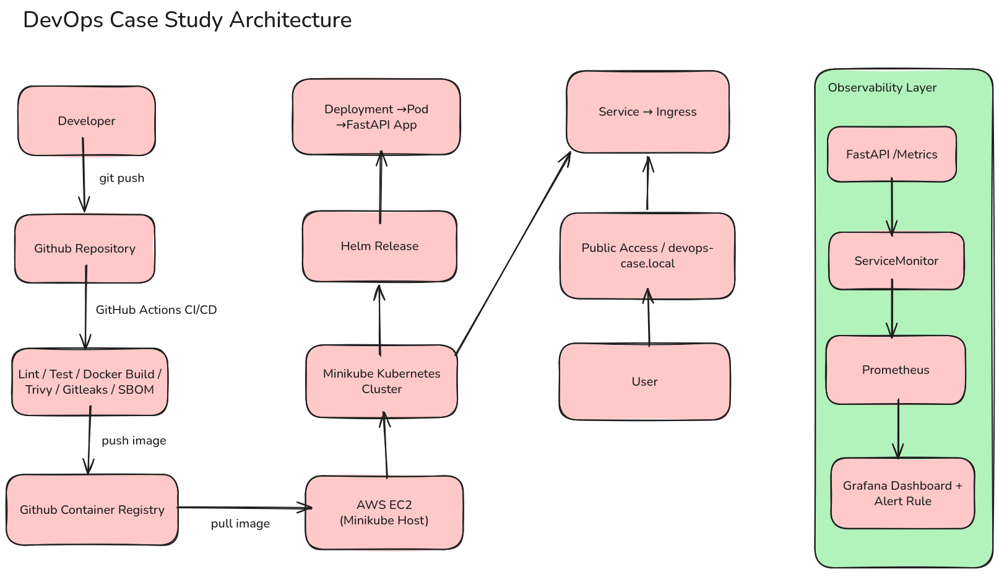
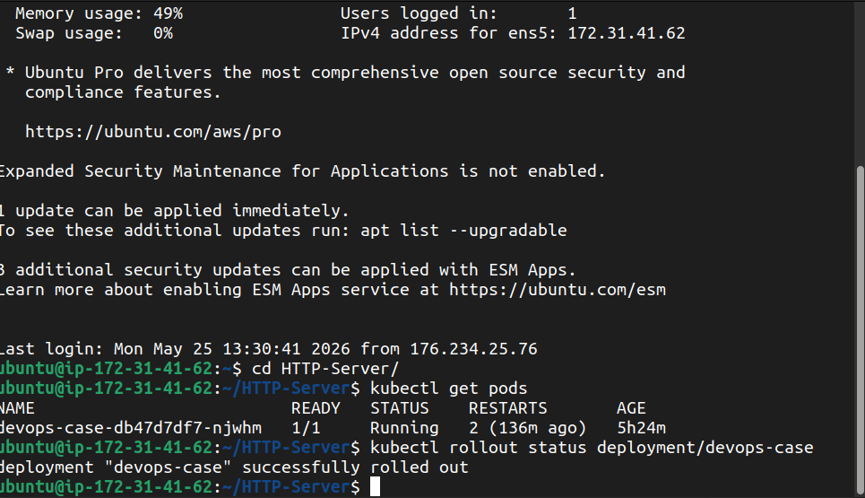
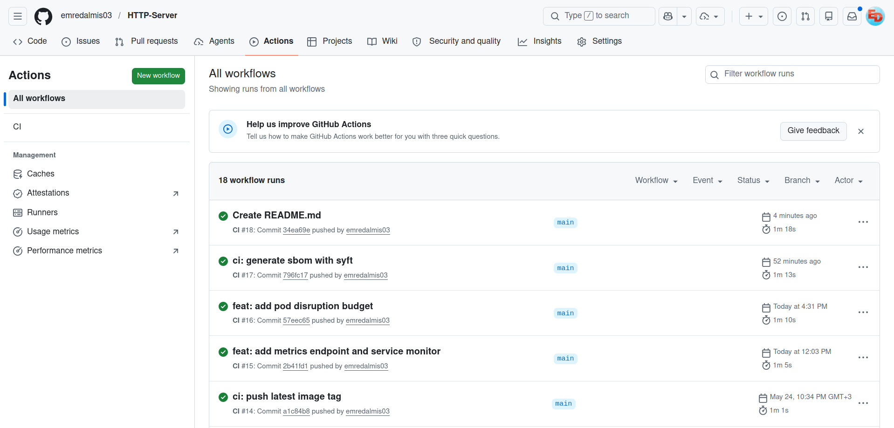
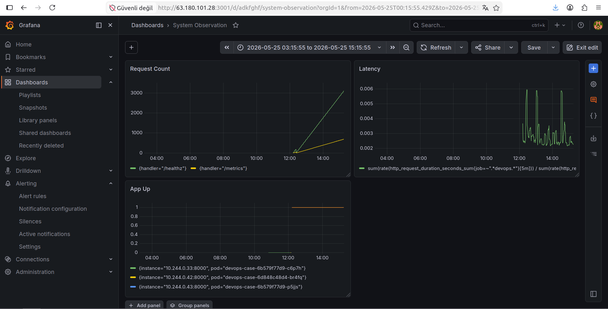
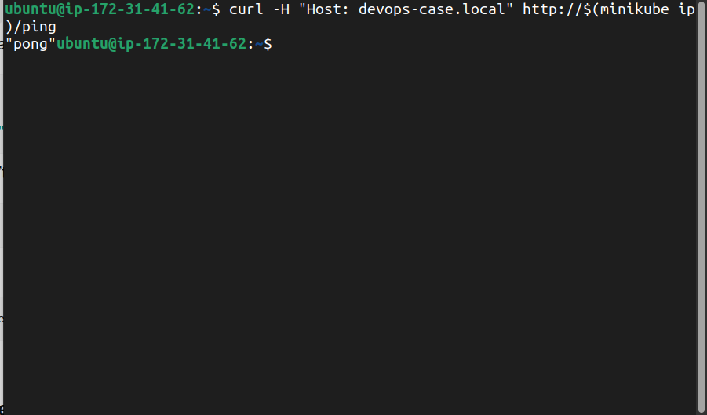

# DevOps Case Study

A lightweight FastAPI-based HTTP service deployed on a Kubernetes environment running on AWS EC2 with Helm, GitHub Actions CI/CD, observability tooling, and security-focused DevOps practices.

---

# Overview

This project was implemented as part of a DevOps case study.

The system includes:

* FastAPI HTTP application
* Docker containerization
* Kubernetes deployment with Helm
* GitHub Actions CI/CD pipeline
* GitHub Container Registry (GHCR)
* Prometheus + Grafana observability stack
* Security scanning and SBOM generation
* Automated deployment to AWS EC2-hosted minikube

---

# Architecture



Main flow:

1. Developer pushes code to GitHub
2. GitHub Actions runs CI/CD pipeline
3. Docker image is built and scanned
4. Image is pushed to GHCR
5. GitHub Actions deploys to EC2 via SSH
6. Helm upgrades the Kubernetes release
7. Prometheus scrapes application metrics
8. Grafana visualizes metrics and alerts

---

# Tech Stack

| Component          | Technology            |
| ------------------ | --------------------- |
| Application        | FastAPI               |
| Containerization   | Docker                |
| Orchestration      | Kubernetes (minikube) |
| Packaging          | Helm                  |
| CI/CD              | GitHub Actions        |
| Container Registry | GHCR                  |
| Observability      | Prometheus + Grafana  |
| Security Scanning  | Trivy + Gitleaks      |
| SBOM               | Syft                  |
| Infrastructure     | AWS EC2               |

---

# Application Endpoints

| Endpoint   | Description                 |
| ---------- | --------------------------- |
| `/ping`    | Returns `"pong"`            |
| `/healthz` | Health check endpoint       |
| `/version` | Returns build SHA           |
| `/metrics` | Prometheus metrics endpoint |

---

# Kubernetes Features

The application is deployed using Helm and includes:

* Deployment
* Service
* Ingress
* ConfigMap
* Secret
* ServiceMonitor
* PodDisruptionBudget
* readinessProbe
* livenessProbe
* resource requests and limits

Environment-specific values are managed through:

* `values-dev.yaml`
* `values-prod.yaml`



---

# CI/CD Pipeline

The GitHub Actions pipeline performs:

* Linting
* Automated tests with `pytest`
* Docker image build
* Trivy vulnerability scanning
* Gitleaks secret scanning
* SBOM generation using Syft
* Push to GitHub Container Registry
* Automated deployment to Kubernetes via Helm

Deployment is triggered automatically on push to the `main` branch.



---

# Observability

The project includes a complete observability setup:

* Prometheus metrics scraping
* Grafana dashboard
* Grafana alert rule
* JSON structured application logs
* FastAPI metrics instrumentation

Metrics are exposed through:

`/metrics`

A `ServiceMonitor` resource is used for Prometheus scraping.



---

# Security

Implemented security practices include:

* Gitleaks secret scanning
* Trivy container image scanning
* SBOM generation using Syft
* Kubernetes Secrets usage
* No hardcoded credentials in repository
* GHCR-based image distribution

GitHub Actions uses the built-in `GITHUB_TOKEN` for GHCR authentication. No long-lived registry token or AWS access key is stored in the repository.

---

# Bonus Features

Implemented optional improvements:

* PodDisruptionBudget
* Syft SBOM generation
* Basic chaos test by deleting a running pod and observing Kubernetes self-healing behavior

---

# Deployment Workflow

## Build Locally

```bash
docker build -t devops-case:latest .
```

## Deploy with Helm

```bash
helm upgrade --install devops-case charts/devops-case \
  -f charts/devops-case/values-dev.yaml
```

## Verify Deployment

```bash
kubectl get pods
kubectl rollout status deployment/devops-case
helm history devops-case
```

## Test Application

```bash
curl -H "Host: devops-case.local" http://$(minikube ip)/ping
```

Expected response:

```text
"pong"
```



---

# Monitoring

## Grafana Port Forward

```bash
kubectl port-forward --address 0.0.0.0 -n monitoring svc/monitoring-grafana 3001:80
```

## Prometheus Port Forward

```bash
kubectl port-forward --address 0.0.0.0 -n monitoring svc/monitoring-kube-prometheus-prometheus 9090:9090
```

---

# Useful Operational Commands

## Check Pods

```bash
kubectl get pods
```

## Check Logs

```bash
kubectl logs -l app.kubernetes.io/name=devops-case --tail=100
```

## Restart Deployment

```bash
kubectl rollout restart deployment/devops-case
```

## Rollback with Helm

```bash
helm history devops-case
helm rollback devops-case <revision>
```

---

# Infrastructure Notes

Track A was used for the case study.

The Kubernetes cluster runs on a self-managed minikube instance hosted on AWS EC2.

To keep the scope focused on the deployment and observability pipeline, the EC2 infrastructure was created manually. Operational reproducibility is supported through a Makefile containing commonly used commands.

A future improvement would be managing the EC2 instance, Elastic IP, and Security Groups through Terraform or OpenTofu.

---

# Repository Structure

```text
.
├── app/
├── charts/
│   └── devops-case/
├── docs/
├── .github/workflows/
├── RUNBOOK.md
├── Makefile
├── Dockerfile
├── requirements.txt
└── README.md
```

---


# Decisions and Tradeoffs

## Why FastAPI?

FastAPI was selected because it is lightweight, simple to containerize, and provides a clean way to expose small HTTP endpoints. It was a good fit for a minimal service with `/ping`, `/healthz`, `/version`, and `/metrics`.

## Why Helm?

Helm was used to package Kubernetes manifests and separate environment-specific values. This made it easier to manage dev and prod differences such as replica count, image tag, resources, and ingress configuration.

## Why GHCR?

GitHub Container Registry was selected because it integrates naturally with GitHub Actions and does not require an external registry account. The CI pipeline can authenticate using `GITHUB_TOKEN`, which avoids storing long-lived registry credentials.

## Why Trivy and Gitleaks?

Trivy was added to scan container images for vulnerabilities. Gitleaks was added to detect accidental secret commits. Together, they provide lightweight supply-chain and repository security checks in CI.

## Why Makefile instead of Terraform?

Track A was implemented using AWS EC2. The EC2 instance, Elastic IP, and Security Group were created manually to keep the case study scope focused and avoid rebuilding a working environment late in the process. A Makefile was added as a lightweight reproducibility layer for common operational tasks. A future improvement would be to define the AWS infrastructure with Terraform or OpenTofu.

---

# Future Improvements

Possible future improvements:

* Terraform/OpenTofu infrastructure provisioning
* Custom domain + TLS
* Horizontal Pod Autoscaler
* GitOps deployment with ArgoCD or Flux
* NetworkPolicies
* Multi-architecture container builds
* Cosign image signing

---

# Author

Emre Dalmış
